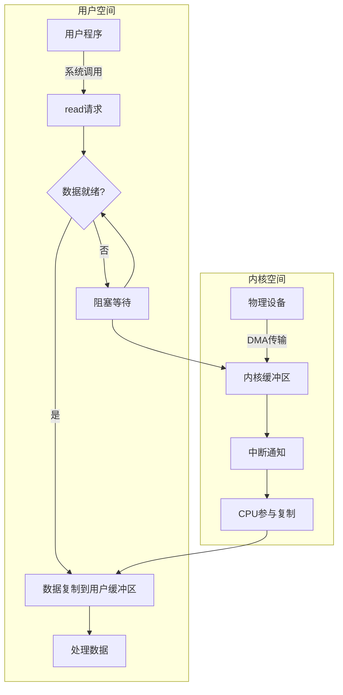
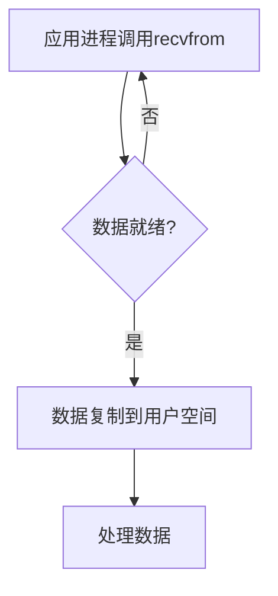

# system

```mermaid
flowchart TD
    subgraph 用户空间
        A[用户程序] -->|系统调用| B[read请求]
        B --> C{数据就绪?}
        C -->|否| D[阻塞等待]
        D --> C
        C -->|是| E[数据复制到用户缓冲区]
        E --> F[处理数据]
    end

    subgraph 内核空间
        G[物理设备] -->|DMA传输| H[内核缓冲区]
        H --> I[中断通知]
        I --> J[CPU参与复制]
    end

    D --> H
    J --> E
```

```mermaid
flowchart TD
    A[应用进程调用recvfrom] --> B{数据就绪?}
    B -- 否 --> A
    B -- 是 --> C[数据复制到用户空间]
    C --> D[处理数据]
```